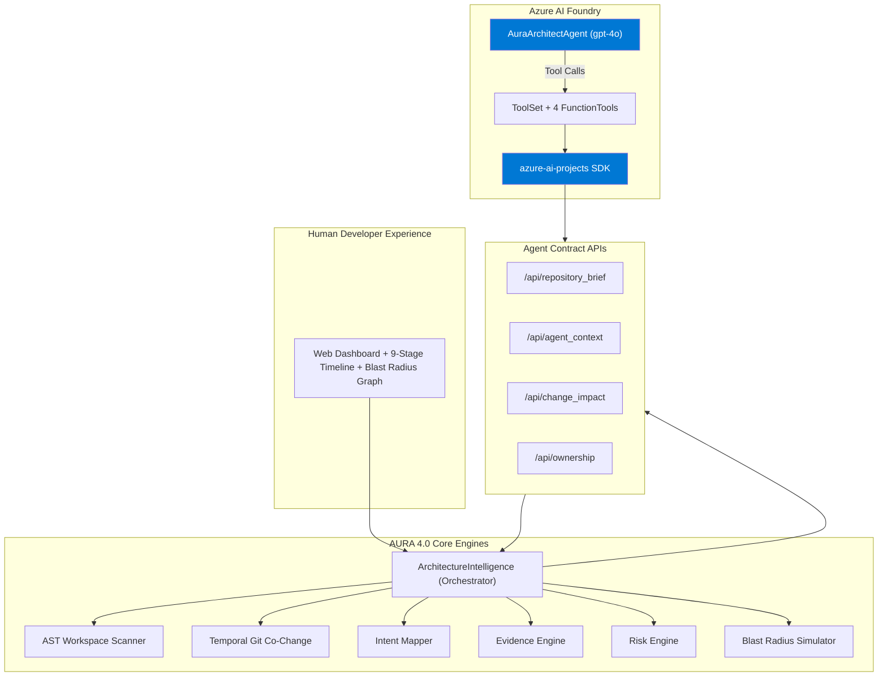

# AURA 4.0 — Architecture Intelligence Layer for AI Coding Agents

> **Give AI agents (and developers) deep, evidence-based understanding of any repository before they make changes.**

AURA 4.0 is a **read-only Architecture Intelligence Layer** designed to be consumed by AI coding agents and human developers. It scans unknown codebases, maps subsystems, simulates the blast radius of hypothetical changes using static AST analysis + temporal Git co-change data, detects architectural risks with citations, and produces safe, verifiable change plans.

It is purpose-built to integrate as **custom tools** inside **Azure AI Foundry** agents (and Semantic Kernel).

---

## Why AURA 4.0?

Traditional developer tools look **backward** (linters, static analyzers, security scanners).  
AURA 4.0 looks **forward**: it answers *"What if we change this?"* before a single line is written.

It is especially valuable for:
- AI coding agents (Claude Code, Cursor, OpenHands, Aider, etc.) that need to understand blast radius before editing
- Azure AI Foundry agents that must reason safely about large, unfamiliar codebases
- Enterprise teams doing high-risk refactors or migrations

---

## Core Capabilities

1. **Workspace Intelligence** — Read-only AST parsing + file fact extraction (no writes, ever).
2. **Temporal Coupling (Chronos)** — Git history co-change analysis to discover "shadow dependencies" that static analysis misses.
3. **Multi-Step Reasoning** — 9-stage visible reasoning timeline (User Intent → Intent Mapping → Subsystem Discovery → Repository Intelligence → Impact Intelligence → Risk Intelligence → Verification Intelligence → Architecture Recommendation → Human Approval).
4. **Blast Radius Simulation** — Predicts affected modules and risk when a specific file or architectural change is proposed.
5. **Cited Risk Detection** — God objects, circular dependencies, missing tests, direct DB access, deep chains, etc. — all with evidence.
6. **Agent-Ready Contract** — Dedicated clean APIs (`/api/agent_context`, `/api/change_impact`, etc.) designed for tool calling.

**Strict Safety Guarantees**
- Zero destructive operations
- Zero file writes into scanned repositories
- All outputs are grounded in real AST + Git data (zero fabrication policy)
- Explicit human approval gate before any suggested change

---

## Microsoft Azure AI Foundry Integration (Primary Value)

AURA 4.0 is designed to be registered as **custom tools** inside agents running in Azure AI Foundry.

### How It Works

Using the official SDK (`integration/foundry_agent.py`):

```python
# Creates a real agent in Azure AI Foundry
agent = project_client.agents.create_agent(
    model="gpt-4o",
    name="AuraArchitectAgent",
    instructions="You are AuraArchitectAgent... Always call the appropriate AURA tool to fetch evidence-grounded context before proposing any code changes.",
    toolset=tools   # Contains get_repository_brief, get_agent_context, get_change_impact, get_ownership
)
```

The four registered tools (via `FunctionTool` + `ToolSet`):

| Tool                    | Purpose                                      | Endpoint                        |
|-------------------------|----------------------------------------------|---------------------------------|
| `get_repository_brief`  | High-level repo + subsystem overview         | `GET /api/repository_brief`     |
| `get_agent_context`     | Goal → recommended targets + companions + verification checklist | `POST /api/agent_context` |
| `get_change_impact`     | Blast radius + risk score for a specific file| `POST /api/change_impact`       |
| `get_ownership`         | Subsystem ownership, entry points, routes    | `POST /api/ownership`           |

See full contract: [docs/agent_contract.md](docs/agent_contract.md)

Also provided:
- `integration/semantic_kernel_plugin.py` — Native Semantic Kernel plugin
- `docs/openapi.json` — Ready to import into Azure AI Foundry portal as a Custom Tool

**Architecture Diagram**: See [docs/architecture_diagram.md](docs/architecture_diagram.md) (required for hackathon submission).

---

## System Architecture



Full detailed diagram with explanations: [docs/architecture_diagram.md](docs/architecture_diagram.md)

---

## API Routes

### Human-Facing + Core
- `POST /api/ingest` — Start analysis (demo or local path)
- `GET /api/status/{analysis_id}`
- `POST /api/explain/{analysis_id}` — Full architecture review (markdown)
- `POST /api/plan/{analysis_id}` — Implementation plan for a goal
- `POST /api/simulate/{analysis_id}` — Blast radius + impact graph data
- `POST /api/aura_think/{analysis_id}` — 9-stage reasoning timeline

### Agent Contract APIs (for Foundry / SK / other agents)
- `GET /api/repository_brief/{analysis_id}`
- `POST /api/agent_context/{analysis_id}`
- `POST /api/change_impact/{analysis_id}`
- `POST /api/ownership/{analysis_id}`

---

## Quick Start

```bash
cd "D:\hackathon"
pip install flask requests
python server.py
```

Open http://localhost:5000

Use the "Load Demo" button for instant 45-second hackathon demos.

### Azure AI Foundry Integration

```bash
pip install azure-ai-projects azure-identity requests
export AZURE_AIPROJECTS_CONNECTION_STRING="..."
python integration/foundry_agent.py
```

This will create a real `AuraArchitectAgent` in your Azure AI Project with AURA tools attached.

---

## Hackathon Demo Script (45 Seconds)

**Slide 1 (0-10s)**  
"Every developer tool looks backward. AURA 4.0 is the forward-looking Architecture Intelligence Layer that AI agents and developers should consult before touching code."

**Slide 2 (10-30s)**  
- Load demo repo  
- Show 9-stage reasoning timeline  
- Enter goal: "Add JWT Authentication"  
- Highlight blast radius graph (direct imports + shadow coupling from Git history)  
- Show cited risks and generated verification checklist

**Slide 3 (30-45s)**  
"Critically, AURA 4.0 is not just a web tool. Using the official Azure AI Projects SDK, we register these capabilities as native tools inside a real Azure AI Foundry agent. The agent is instructed to call AURA tools for context and impact analysis before every proposed edit. This is exactly the kind of grounded, multi-step reasoning the Reasoning Agents track is looking for."

See full 45-second script and visuals in [pitch_deck_and_demo.md](pitch_deck_and_demo.md).

---

## Files of Interest for Judges

- `integration/foundry_agent.py` — Official SDK integration (ToolSet + FunctionTool)
- `docs/agent_contract.md` — Complete agent API contract + Foundry mapping
- `docs/architecture_diagram.md` — Required architecture diagram for submission
- `docs/openapi.json` — OpenAPI spec for custom tool registration
- `project code base/core/architecture_intelligence.py` — Clean orchestrator for agent tools
- `server.py` — All endpoints (including the four new agent contract routes)

---

## Roadmap (Honest)

- Currently strongest on Python repositories (AST + Git).
- Future: tree-sitter for multi-language, local embeddings for better intent matching, deeper Azure integration (e.g. direct deployment as a Foundry tool plugin).

---

**AURA 4.0 is ready for the Reasoning Agents track.**  
It gives Microsoft Foundry agents (and any other AI coding agent) the repository intelligence and safety guardrails they currently lack.

For the full submission package, see:
- This README
- [docs/architecture_diagram.md](docs/architecture_diagram.md)
- [docs/agent_contract.md](docs/agent_contract.md)
- The `integration/` folder
