# AURA 4.0 Architecture Diagram

**For Microsoft Agents League Hackathon Submission (Reasoning Agents Track)**

This diagram illustrates how AURA 4.0 provides a specialized **Architecture Intelligence Layer** that is consumed by agents running in **Azure AI Foundry**.

## Visual Architecture Diagram (Mermaid)

```mermaid
flowchart TD
    subgraph User["👤 Developer / AI Coding Agent User"]
        direction TB
        WebUI["AURA Web Dashboard<br/>• Ingest Repository<br/>• 9-Stage Reasoning Timeline<br/>• Interactive Blast Radius Graph<br/>• Safe Change Plan + Verification Checklist"]
        Prompt["Natural Language Goal<br/>e.g. 'Add JWT Authentication' or 'Replace Postgres with Cosmos DB'"]
    end

    subgraph Core["🧠 AURA 4.0 - Architecture Intelligence Layer (Core)"]
        direction TB
        ArchInt["ArchitectureIntelligence<br/>(Orchestrator)"]
        
        subgraph Engines["Reasoning Engines"]
            Scanner["Workspace Scanner<br/>AST + File Facts"]
            Chronos["Chronos Git Engine<br/>Temporal Co-Change Analysis"]
            Intent["Intent Mapper<br/>Goal → Concepts → Subsystems"]
            Evidence["Evidence Engine<br/>Companion Edits Discovery"]
            Risk["Risk Engine<br/>God Objects, Cycles, Missing Tests, etc."]
            Blast["Blast Radius Simulator<br/>Static + Temporal Fusion"]
        end
    end

    subgraph AgentAPIs["🔌 Agent Contract APIs<br/>(New Dedicated Endpoints)"]
        direction TB
        Brief["GET /api/repository_brief/{id}<br/>High-level repo summary + subsystems"]
        Context["POST /api/agent_context/{id}<br/>Goal-aware targets, companions, verification"]
        Impact["POST /api/change_impact/{id}<br/>Blast radius + risk score for a file"]
        Ownership["POST /api/ownership/{id}<br/>Subsystem ownership + routes + entrypoints"]
    end

    subgraph Microsoft["☁️ Microsoft Azure AI Foundry Integration"]
        direction TB
        FoundryAgent["Azure AI Foundry Agent<br/>Name: AuraArchitectAgent<br/>Model: gpt-4o (or equivalent)"]
        
        subgraph Tools["Registered Tools (via ToolSet)"]
            T1["get_repository_brief"]
            T2["get_agent_context"]
            T3["get_change_impact"]
            T4["get_ownership"]
        end

        SDK["azure-ai-projects SDK<br/>integration/foundry_agent.py"]
        ToolReg["FunctionTool Wrappers<br/>+ ToolSet.add()"]
        
        Alt["Alternative: Semantic Kernel Plugin<br/>integration/semantic_kernel_plugin.py"]
        OpenAPI["OpenAPI 3.0 Spec<br/>docs/openapi.json<br/>(Import as Custom Tool)"]
    end

    %% Flows
    WebUI --> Prompt
    Prompt -->|POST /api/ingest + goal| ArchInt
    ArchInt --> Scanner & Chronos & Intent & Evidence & Risk & Blast

    ArchInt --> Brief & Context & Impact & Ownership

    FoundryAgent -->|Always calls tools before proposing edits| ToolReg
    ToolReg --> SDK
    SDK -->|HTTP requests| Brief & Context & Impact & Ownership
    Brief & Context & Impact & Ownership --> ArchInt

    FoundryAgent -.->|Alternative path| Alt
    SDK -.-> OpenAPI

    %% Styling
    classDef microsoft fill:#0078D4,color:#fff,stroke:#004578
    classDef core fill:#1f1f1f,color:#fff,stroke:#ff8c00
    classDef api fill:#2d2d2d,color:#fff,stroke:#00b294
    classDef user fill:#f3f2f1,color:#201f1e,stroke:#0078d4

    class FoundryAgent,SDK,ToolReg,Alt,OpenAPI microsoft
    class ArchInt,Engines,Scanner,Chronos,Intent,Evidence,Risk,Blast core
    class Brief,Context,Impact,Ownership,AgentAPIs api
    class User,WebUI,Prompt user
```



## How the Integration Works (Key for Judges)

1. **Human Path (Web Experience)**
   - Developer runs local AURA server.
   - Ingests a repository (real or demo).
   - Interacts with rich UI showing 9-stage reasoning timeline, impact graph, risks, and a safe change plan.
   - This proves the core intelligence is powerful on its own.

2. **Agent Path (Azure AI Foundry)**
   - Using `integration/foundry_agent.py` (official `azure-ai-projects` SDK):
     - Connects to an Azure AI Project via connection string.
     - Creates a real **AuraArchitectAgent** in Azure AI Foundry.
     - Registers four `FunctionTool`s that point back to the AURA server’s agent contract endpoints.
   - Instructions to the agent: *"Always call the appropriate AURA tool to fetch evidence-grounded context before proposing any code changes. Strictly respect the read-only policy."*
   - The Foundry agent must use multi-step tool calling (get context → assess impact → check ownership → plan safely) before it can reason about edits.

3. **Why This Qualifies Strongly for Reasoning Agents Track**
   - The solution is **not** just another agent built on Foundry.
   - It is a **specialized, evidence-based reasoning layer** that Foundry agents (and other AI coding agents) should call before making changes.
   - Heavy emphasis on **multi-step thinking**, **cited evidence**, **blast radius simulation**, and **safety gates** (Reliability & Safety criterion).
   - Uses official Microsoft SDKs and patterns (ToolSet, Function Calling, OpenAPI for custom tools).

## How to Create a Polished Visual for Submission

1. Copy the Mermaid code above into [mermaid.live](https://mermaid.live) or VS Code + Mermaid extension.
2. Export as PNG/SVG (high resolution).
3. Or paste into draw.io / Excalidraw / Lucidchart and add icons, colors, and Microsoft branding.
4. Recommended filename for submission: `aura-4-0-architecture-diagram.png`

**Alternative simple block diagram (for quick reference):**

```
[Developer / AI Agent] 
        │
        ▼
[AURA Web UI + 9-Stage Timeline + Blast Graph]
        │
        ▼
[AURA 4.0 Core Engines]
  (AST Scanner + Git Chronos + Intent + Evidence + Risk + Blast Radius)
        │
        ▼
[Agent Contract APIs]
  /repository_brief   /agent_context   /change_impact   /ownership
        ▲
        │ HTTP
        │
[Azure AI Foundry] ──(ToolSet + FunctionTools)──> AuraArchitectAgent (gpt-4o)
        │
        └── Created by: integration/foundry_agent.py (azure-ai-projects SDK)
```

## Files Demonstrating the Integration

- `integration/foundry_agent.py` — Real SDK code that provisions the Foundry agent + registers tools
- `integration/semantic_kernel_plugin.py` — Semantic Kernel alternative
- `docs/openapi.json` — Ready for portal import as Custom Tool
- `docs/agent_contract.md` — Full contract + mapping
- `project code base/core/architecture_intelligence.py` + new endpoints in `server.py`

This architecture directly addresses the hackathon requirement: **"An architecture diagram illustrating how your solution uses Microsoft Foundry..."**

---

**Status for Submission**: Ready to include as the required architecture diagram.
