# AURA 4.0 — 45-Second Hackathon Pitch Deck & Demo Plan

**Target:** Microsoft Agents League Hackathon — Reasoning Agents Track

This pitch is optimized for a high-pressure 45-second judge presentation. It demonstrates both the powerful human-facing experience **and** the first-class Azure AI Foundry agent integration.

---

## Part 1: 3-Slide Pitch Script (45 Seconds)

```mermaid
gantt
    title 45-Second Pitch Timeline
    dateFormat  X
    axisFormat %s
    section Slides
    Slide 1: The Problem + Identity     :0, 12
    Slide 2: Live Demo + Agent Tools    :12, 32
    Slide 3: Microsoft Foundry Story    :32, 45
```

### Slide 1: The Hook (0:00 – 0:12)
**Visual:** Split contrast card
- Left (gray, backward arrow): "Traditional Tools — Retrospective (What is)"
- Right (bright blue/orange): "AURA 4.0 — Predictive Architecture Intelligence (What would happen if...)"

**Speaker Script:**
> "Every developer tool on the market looks backward. Linters, security scanners, and even most AI coding assistants only analyze code after it has already been written.
>
> Meet **AURA 4.0** — the Architecture Intelligence Layer that tells AI agents and developers what will happen *before* they touch a single line of code. It combines AST analysis with Git history co-change detection to simulate blast radius, surface hidden risks, and generate safe, verifiable change plans."

### Slide 2: Live Technical Demo (0:12 – 0:32)
**Visual:** Split screen
- Left: Terminal or browser showing goal input
- Right: AURA Dashboard with glowing 9-stage reasoning timeline + interactive blast radius SVG graph

**Speaker Script (with live actions):**
> "Watch this in action. We load a demo repository and ask: *'What if we add JWT authentication?'*
>
> [Click / type goal]
>
> AURA immediately runs its 9-stage reasoning process — Intent Mapping, Subsystem Discovery, Impact Intelligence, Risk Intelligence with cited evidence, and a full verification checklist.
>
> Look at the graph: blue edges are direct AST imports. Amber nodes are *shadow dependencies* discovered only through Git co-change history. The agent (or human) now knows exactly which files will be affected and what risks exist before writing any code."

**Key things to point out in 20 seconds:**
- 9-stage visible reasoning timeline
- Blast radius score + affected modules
- Cited risks (with evidence)
- Generated verification commands + human approval gate

### Slide 3: Microsoft Foundry Integration (0:32 – 0:45)
**Visual:** Clean architecture flow
- AURA Core → Agent Contract APIs → Azure AI Foundry (AuraArchitectAgent) with ToolSet
- Small callouts: `azure-ai-projects` SDK, `FunctionTool`, `ToolSet`

**Speaker Script:**
> "This is where AURA 4.0 becomes a true Reasoning Agent enabler.
>
> Using the official Azure AI Projects SDK, we register AURA’s capabilities as native tools inside a real Azure AI Foundry agent called **AuraArchitectAgent**.
>
> The agent is explicitly instructed: *'Always call the appropriate AURA tool to fetch evidence-grounded context and blast radius before proposing any code changes.'*
>
> The four tools (`get_agent_context`, `get_change_impact`, etc.) are registered via `ToolSet` and `FunctionTool`. We also provide an OpenAPI spec and a Semantic Kernel plugin.
>
> AURA gives Foundry agents the repository intelligence and safety guardrails they currently lack. This is grounded, multi-step, evidence-based reasoning — exactly what the Reasoning Agents track is designed to reward."

**Close strong:**
> "Thank you. AURA 4.0 — Architecture Intelligence for AI Agents that actually need to understand the code before they break it."

---

## Part 2: Detailed Demo Execution Plan (For Live Delivery)

### Pre-Demo Setup (Critical)
1. Open `http://localhost:5000` (ingest page)
2. Have `dashboard.html` or `dashboard_mockup.html` ready in another tab
3. (Optional but powerful) Have `integration/foundry_agent.py` open or pre-run in terminal to show the SDK code
4. Have the architecture diagram (`docs/architecture_diagram.md` rendered or image) ready to show on Slide 3

### Live Demo Steps (Slide 2)

**Step 1 (0:12–0:15)**  
- Click **"Load Demo"** on the ingest page
- Say: "We simulate ingesting an unfamiliar repository in read-only mode."

**Step 2 (0:15–0:20)**  
- Once dashboard loads, point to the health scores, subsystems, and risks.
- Say: "Full architectural understanding in seconds — with cited evidence, not hallucinations."

**Step 3 (0:20–0:25)**  
- Click one of the goal chips (e.g. "Add JWT Authentication") **or** type a goal and hit Plan/Simulate.
- Immediately switch to the reasoning timeline view if available (`/api/aura_think`).

**Step 4 (0:25–0:30)**  
- Hover nodes on the impact graph.
- Highlight one amber "shadow coupling" node and explain it came from Git history, not imports.
- Point to the verification checklist and risk citations.

**Step 5 (0:30–0:32)**  
- Transition: "This is already extremely useful for humans. But the real power is when we give this capability to agents running in Azure AI Foundry..."

### Slide 3 Delivery (0:32–0:45)

1. Quickly show `integration/foundry_agent.py` (or have it pre-copied).
2. Point out the `AIProjectClient`, `ToolSet`, and the four `FunctionTool` definitions.
3. Say: "We use the official Microsoft SDK to create a real agent in Foundry that has AURA tools attached."
4. If time permits, show the instructions string that forces the agent to call AURA tools first.
5. End with: "The agent cannot responsibly propose changes without first consulting AURA’s blast radius and risk intelligence."

---

## Bonus: Extended 90-Second Version (If Allowed)

If judges give you more time or you’re doing a longer showcase:

1. 0-45s — Run the above 45-second pitch.
2. 45-70s — Show the actual Foundry integration script running (or a screenshot of the agent being created in the portal).
3. 70-90s — Quick live call to one of the agent contract endpoints (e.g. `/api/agent_context`) and show the clean JSON the Foundry agent would receive.
4. Close with the architecture diagram.

---

## Submission Assets Checklist

- [x] This pitch deck + demo plan
- [x] Updated README.md (AURA 4.0 + Foundry focus)
- [x] `docs/architecture_diagram.md` (required architecture diagram)
- [x] `docs/agent_contract.md`
- [x] `integration/foundry_agent.py` (real SDK code)
- [x] Public GitHub with working code + demo mode

**Recommended Demo Video Structure (max 5 minutes):**
1. 0:00–0:45 — Condensed 45-second pitch (use the script above)
2. 0:45–2:30 — Full human dashboard demo with live goal + graph + timeline
3. 2:30–4:00 — Show `foundry_agent.py` and explain how the agent is created + tools registered
4. 4:00–5:00 — Show the architecture diagram + summarize why this is strong for Reasoning Agents

---

**You are ready.**  
The combination of deep technical reasoning engines + first-class Azure AI Foundry tool integration is exactly what this track is looking for.

Good luck in the Agents League!